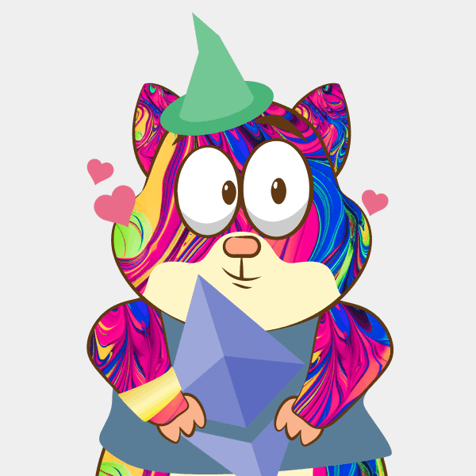

# GenerativeNFTDApp
generative-nft-libraryを利用してNFT生成＆発行DApp用のリポジトリになります。

### Generative Art NFT とは？？

さまざまな特徴を画像として作成した後、コードよってそれらを組み合わせ生成する NFT のこと

## Generative NFTの参考例

Scrappy Squirrelsは、Generative NFT Artの代表例
※ 下のgifはそのサンプル



## サンプル画像の生成コマンド
 `cd GenerativeNFT`  
 `python nft.py`  

 何体分の画像データを生成するか確認されるので適当な数字を入力する。

## IPFSにアップロードしたメタデータのURI
　http://127.0.0.1:5001/ipfs/bafybeihcyruaeza7uyjd6ugicbcrqumejf6uf353e5etdkhotqffwtguva/#/files/json  

## テストネットにデプロイした例
 下記はRinkebyにデプロイした際のターミナルの出力例

 ```cmd
NFTCollectible.address: 0x587E68B8b22d803Ac0aAF568e87c6fE12DA103E7
10 NFTs have been reserved
Owner has tokens:  [
  BigNumber { value: "0" },
  BigNumber { value: "1" },
  BigNumber { value: "2" },
  BigNumber { value: "3" },
  BigNumber { value: "4" },
  BigNumber { value: "5" },
  BigNumber { value: "6" },
  BigNumber { value: "7" },
  BigNumber { value: "8" },
  BigNumber { value: "9" },
  BigNumber { value: "10" },
  BigNumber { value: "11" },
  BigNumber { value: "12" }
]
 ```

 下記は、Mumbaiネットワークへのデプロイ記録
 ```cmd
 NFTCollectible.address: 0xfe03B6a6B4B095248F06Ed9528e913995ED58f97
 Owner has tokens:  [] 
 ```

 下記は、Shibuya Network(Astar networkのテストネット)へのデプロイ記録
 ```cmd
 NFTCollectible.address: 0xAa363921A48Eac63F802C57658CdEde768B3DAe1
Owner has tokens:  []
 ```

 下記は、Avalancheのテストネットへのデプロイ記録
 ```cmd
> nft-collectible@1.0.0 deploy:fuji
> npx hardhat run scripts/deploy.js --network fuji

NFTCollectible.address: 0x8DF7e6234f76e8fAC829feF83E7520635359094C
Owner has tokens:  []
 ```

下記は、Astar Networkへのデプロイ記録
```cmd
> nft-collectible@1.0.0 deploy:astar
> npx hardhat run scripts/deploy.js --network astar

NFTCollectible.address: 0x599c542e6FF0e009D929091e948d2BA510136741
Owner has tokens:  []
```

### コントラクトの検証結果(Rinkeby)
 ```cmd
 contracts/NFTCollectible.sol:NFTCollectible at 0x587E68B8b22d803Ac0aAF568e87c6fE12DA103E7
for verification on the block explorer. Waiting for verification result...

Successfully verified contract NFTCollectible on Etherscan.
https://rinkeby.etherscan.io/address/0x587E68B8b22d803Ac0aAF568e87c6fE12DA103E7#code
 ```

 <a href="https://rinkeby.etherscan.io/address/0x587E68B8b22d803Ac0aAF568e87c6fE12DA103E7#code">https://rinkeby.etherscan.io/address/0x587E68B8b22d803Ac0aAF568e87c6fE12DA103E7#code</a>

### コントラクトの検証結果(Mumbai)
 ```cmd
 Successfully submitted source code for contract
contracts/NFTCollectible.sol:NFTCollectible at 0xfe03B6a6B4B095248F06Ed9528e913995ED58f97
for verification on the block explorer. Waiting for verification result...

Successfully verified contract NFTCollectible on Etherscan.
https://mumbai.polygonscan.com/address/0xfe03B6a6B4B095248F06Ed9528e913995ED58f97#code 
 ```

 <a href="https://mumbai.polygonscan.com/address/0xfe03B6a6B4B095248F06Ed9528e913995ED58f97#code">https://mumbai.polygonscan.com/address/0xfe03B6a6B4B095248F06Ed9528e913995ED58f97#code</a>

## コントラクトのアドレス

|ネットワーク|コントラクトアドレス|
|---|---|
|Munbai Network|0xfe03B6a6B4B095248F06Ed9528e913995ED58f97|
|Shibuya Network|0xAa363921A48Eac63F802C57658CdEde768B3DAe1|
|Shiden|[0xAa363921A48Eac63F802C57658CdEde768B3DAe1](https://blockscout.com/shiden/address/0xAa363921A48Eac63F802C57658CdEde768B3DAe1)|
|Avalanche testnet|0x8DF7e6234f76e8fAC829feF83E7520635359094C|
|Rinkeby|0x587E68B8b22d803Ac0aAF568e87c6fE12DA103E7|
|BSC Testnet|0x67ADc29278d87D87b212C59fDffd2749fe7418c4|
|Astar Network|[0x599c542e6FF0e009D929091e948d2BA510136741](https://blockscout.com/astar/address/0x599c542e6FF0e009D929091e948d2BA510136741)|

### Morails APIを利用してNFTを取得するAPIの例

```zsh
curl -X 'GET' \
  'https://deep-index.moralis.io/api/v2/0x51908F598A5e0d8F1A3bAbFa6DF76F9704daD072/nft?chain=eth&format=decimal' \
  -H 'accept: application/json' \
  -H 'X-API-Key: My-API-Key' \
```
レスポンスの例
```json
{
  "total":2,
  "page":1,
  "page_size":100,
  "cursor":null,
  "result":[
    {
      "token_address":"0x495f947276749ce646f68ac8c248420045cb7b5e","token_id":"45787235281977386256108734909224890778381910259413089066894436982617255444580","owner_of":"0x51908f598a5e0d8f1a3babfa6df76f9704dad072",
      "block_number":"15183166",
      "block_number_minted":"15179086",
      "token_hash":"595d01884112fc450c75cff46a92fdfb",
      "amount":"1",
      "contract_type":"ERC1155",
      "name":"OpenSea Shared Storefront",
      "symbol":"OPENSTORE",
      "token_uri":"https://api.opensea.io/api/v1/metadata/0x495f947276749Ce646f68AC8c248420045cb7b5e/0x653aa8234f0f3d8a26002228973b046bd04131d3000000000000040000000064",
      "metadata":"{\"name\":\"【あまてらす】　応援ペンライト\",\"description\":\"学校:京都メタバ学園\\nグループ:あまてらす\\n\\n【インセンティブ】\\n保有するグループが通う学校のdiscord学級委員会に参加可能\\nアイドル総選挙時に投票券として使用可能\",\"external_link\":null,\"image\":\"https://lh3.googleusercontent.com/4m_jwIYLL93-Kj4qiNTXjvqoDCbrdmRfc2pGCXfoc39CYibui-Av3wF93XhOz78n8v9uyLny_I3rBOxweFqzrTxDy4FObDcQr12RQw\",\"animation_url\":null}",
      "last_token_uri_sync":"2022-07-24T12:54:07.536Z",
      "last_metadata_sync":"2022-07-24T15:49:13.372Z"
    },{
      "token_address":"0x36b193a0cc219fd86945cce60c3ac89bacc9658d",
      "token_id":"4582",
      "owner_of":"0x51908f598a5e0d8f1a3babfa6df76f9704dad072",
      "block_number":"14947587",
      "block_number_minted":"14947587",
      "token_hash":"6d5793e5f989a5492b1579c862872812",
      "amount":"1",
      "contract_type":"ERC721",
      "name":"MetaVectors",
      "symbol":"MTV",
      "token_uri":"https://ipfs.moralis.io:2053/ipfs/QmYKPWHjK2Yt5HpJ1FmfFuxw6swxCdp7zCq2hYFcDnHGkt/4582",
      "metadata":"{\"name\":\"MetaVectors #4583\",\"description\":\"MetaVectors - Unlock Your Inner Self\",\"image\":\"ipfs://QmdDLFb9q7p4c7Eaw1hnZDWLAgbgPEzprmXaQPcbAjYcRz/4583.png\",\"attributes\":[{\"trait_type\":\"Back Background\",\"value\":\"bg26\"},{\"trait_type\":\"Front Background\",\"value\":\"fb28\"},{\"trait_type\":\"Body\",\"value\":\"body10\"},{\"trait_type\":\"Mask\",\"value\":\"m16\"}],\"edition\":4583,\"date\":1654635943698,\"compiler\":\"HashLips Art Engine\"}","last_token_uri_sync":"2022-06-12T02:00:37.619Z",
      "last_metadata_sync":"2022-06-12T02:00:42.492Z"
    }],
    "status":"SYNCED"
}
``` 

mumbaiの特定のコントラクトのNFTの情報を取得する場合場合
```zsh
curl -X 'GET' \
  'https://deep-index.moralis.io/api/v2/nft/0xfe03b6a6b4b095248f06ed9528e913995ed58f97?chain=mumbai&format=decimal' \
  -H 'accept: application/json'\
  -H 'X-API-Key: My-API-Key' 
```

レスポンス
```json
{
  "total":25,"page":0,"page_size":100,"cursor":null,"result":[{"token_address":"0xfe03b6a6b4b095248f06ed9528e913995ed58f97","token_id":"1","amount":"1","token_hash":"ffd8d9c00dd64a2afdd3661d355e3814","block_number_minted":"26611791","updated_at":null,"contract_type":"ERC721","name":"My NFT Collectible","symbol":"NFTC","token_uri":"https://ipfs.moralis.io:2053/ipfs/QmVBo9Httns6eAbqH2voWMkAGY2RxDeKmMcfafV1uE2gcW/1","metadata":"{\"name\":\"My First Collection #1\",\"description\":\"\",\"image\":\"ipfs://QmTPaTaJwbdjfZ3cNb46bdxST3Fe9gaU4tB46bACwALNd9/01.png\",\"attributes\":[{\"trait_type\":\"Background\",\"value\":\"white\"},{\"trait_type\":\"Body\",\"value\":\"maroon\"},{\"trait_type\":\"Eyes\",\"value\":\"standard\"},{\"trait_type\":\"Held Item\",\"value\":\"nut\"},{\"trait_type\":\"Hands\",\"value\":\"standard\"}]}","last_token_uri_sync":"2022-06-05T09:24:25.143Z","last_metadata_sync":"2022-06-05T09:24:26.662Z"},{"token_address":"0xfe03b6a6b4b095248f06ed9528e913995ed58f97","token_id":"6","amount":"1","token_hash":"fa172747a92d1bd285b21808a80d3924","block_number_minted":"26611824","updated_at":null,"contract_type":"ERC721","name":"My NFT Collectible","symbol":"NFTC","token_uri":"https://ipfs.moralis.io:2053/ipfs/QmVBo9Httns6eAbqH2voWMkAGY2RxDeKmMcfafV1uE2gcW/6","metadata":"{\"name\":\"My First Collection #6\",\"description\":\"\",\"image\":\"ipfs://QmTPaTaJwbdjfZ3cNb46bdxST3Fe9gaU4tB46bACwALNd9/06.png\",\"attributes\":[{\"trait_type\":\"Background\",\"value\":\"white\"},{\"trait_type\":\"Body\",\"value\":\"maroon\"},{\"trait_type\":\"Eyes\",\"value\":\"standard\"},{\"trait_type\":\"Clothes\",\"value\":\"blue_dot\"},{\"trait_type\":\"Held Item\",\"value\":\"nut\"},{\"trait_type\":\"Hands\",\"value\":\"standard\"}]}","last_token_uri_sync":"2022-06-05T09:29:56.657Z","last_metadata_sync":"2022-06-05T09:29:57.603Z"},{"token_address":"0xfe03b6a6b4b095248f06ed9528e913995ed58f97","token_id":"20","amount":"1","token_hash":"eed23a18a5810c2c5928d172cd4b0f8b","block_number_minted":"27843309","updated_at":null,"contract_type":"ERC721","name":"My NFT Collectible","symbol":"NFTC","token_uri":"https://ipfs.moralis.io:2053/ipfs/QmVBo9Httns6eAbqH2voWMkAGY2RxDeKmMcfafV1uE2gcW/20","metadata":null,"last_token_uri_sync":"2022-08-30T13:08:49.733Z","last_metadata_sync":"2022-10-06T04:56:30.092Z"},{"token_address":"0xfe03b6a6b4b095248f06ed9528e913995ed58f97","token_id":"7","amount":"1","token_hash":"ee20152e89cd189f470fc7993f973789","block_number_minted":"26611905","updated_at":null,"contract_type":"ERC721","name":"My NFT Collectible","symbol":"NFTC","token_uri":"https://ipfs.moralis.io:2053/ipfs/QmVBo9Httns6eAbqH2voWMkAGY2RxDeKmMcfafV1uE2gcW/7","metadata":"{\"name\":\"My First Collection #7\",\"description\":\"\",\"image\":\"ipfs://QmTPaTaJwbdjfZ3cNb46bdxST3Fe9gaU4tB46bACwALNd9/07.png\",\"attributes\":[{\"trait_type\":\"Background\",\"value\":\"blue\"},{\"trait_type\":\"Body\",\"value\":\"maroon\"},{\"trait_type\":\"Eyes\",\"value\":\"standard\"},{\"trait_type\":\"Head Gear\",\"value\":\"std_lord\"},{\"trait_type\":\"Clothes\",\"value\":\"blue_dot\"},{\"trait_type\":\"Held Item\",\"value\":\"nut\"},{\"trait_type\":\"Hands\",\"value\":\"standard\"}]}","last_token_uri_sync":"2022-06-05T09:38:01.211Z","last_metadata_sync":"2022-06-05T09:38:02.700Z"},{"token_address":"0xfe03b6a6b4b095248f06ed9528e913995ed58f97","token_id":"3","amount":"1","token_hash":"e34c9ab81e4f9afea255e38519c6a7e9","block_number_minted":"26611802","updated_at":null,"contract_type":"ERC721","name":"My NFT Collectible","symbol":"NFTC","token_uri":"https://ipfs.moralis.io:2053/ipfs/QmVBo9Httns6eAbqH2voWMkAGY2RxDeKmMcfafV1uE2gcW/3","metadata":"{\"name\":\"My First Collection #3\",\"description\":\"\",\"image\":\"ipfs://QmTPaTaJwbdjfZ3cNb46bdxST3Fe9gaU4tB46bACwALNd9/03.png\",\"attributes\":[{\"trait_type\":\"Background\",\"value\":\"white\"},{\"trait_type\":\"Body\",\"value\":\"maroon\"},{\"trait_type\":\"Eyes\",\"value\":\"standard\"},{\"trait_type\":\"Held Item\",\"value\":\"nut\"},{\"trait_type\":\"Hands\",\"value\":\"standard\"},{\"trait_type\":\"Wristband\",\"value\":\"dark-green\"}]}","last_token_uri_sync":"2022-06-05T09:26:15.717Z","last_metadata_sync":"2022-06-05T09:26:16.650Z"},{"token_address":"0xfe03b6a6b4b095248f06ed9528e913995ed58f97","token_id":"4","amount":"1","token_hash":"d974557f106daf89650713e3ee187333","block_number_minted":"26611810","updated_at":null,"contract_type":"ERC721","name":"My NFT Collectible","symbol":"NFTC","token_uri":"https://ipfs.moralis.io:2053/ipfs/QmVBo9Httns6eAbqH2voWMkAGY2RxDeKmMcfafV1uE2gcW/4","metadata":"{\"name\":\"My First Collection #4\",\"description\":\"\",\"image\":\"ipfs://QmTPaTaJwbdjfZ3cNb46bdxST3Fe9gaU4tB46bACwALNd9/04.png\",\"attributes\":[{\"trait_type\":\"Background\",\"value\":\"blue\"},{\"trait_type\":\"Body\",\"value\":\"maroon\"},{\"trait_type\":\"Eyes\",\"value\":\"standard\"},{\"trait_type\":\"Head Gear\",\"value\":\"std_lord\"},{\"trait_type\":\"Held Item\",\"value\":\"nut\"},{\"trait_type\":\"Hands\",\"value\":\"standard\"}]}","last_token_uri_sync":"2022-06-05T09:27:36.088Z","last_metadata_sync":"2022-06-05T09:27:37.611Z"},{"token_address":"0xfe03b6a6b4b095248f06ed9528e913995ed58f97","token_id":"19","amount":"1","token_hash":"d6af278046d1448f5ff5ef096451d399","block_number_minted":"27843309","updated_at":null,"contract_type":"ERC721","name":"My NFT Collectible","symbol":"NFTC","token_uri":"https://ipfs.moralis.io:2053/ipfs/QmVBo9Httns6eAbqH2voWMkAGY2RxDeKmMcfafV1uE2gcW/19","metadata":null,"last_token_uri_sync":"2022-08-30T13:08:46.667Z","last_metadata_sync":"2022-10-06T04:56:30.092Z"},{"token_address":"0xfe03b6a6b4b095248f06ed9528e913995ed58f97","token_id":"11","amount":"1","token_hash":"a01b734b9c004be52bb93d9dd6cd8705","block_number_minted":"26614003","updated_at":null,"contract_type":"ERC721","name":"My NFT Collectible","symbol":"NFTC","token_uri":"https://ipfs.moralis.io:2053/ipfs/QmVBo9Httns6eAbqH2voWMkAGY2RxDeKmMcfafV1uE2gcW/11","metadata":"{\"name\":\"My First Collection #11\",\"description\":\"\",\"image\":\"ipfs://QmTPaTaJwbdjfZ3cNb46bdxST3Fe9gaU4tB46bACwALNd9/11.png\",\"attributes\":[{\"trait_type\":\"Background\",\"value\":\"blue\"},{\"trait_type\":\"Body\",\"value\":\"maroon\"},{\"trait_type\":\"Eyes\",\"value\":\"standard\"},{\"trait_type\":\"Head Gear\",\"value\":\"std_lord\"},{\"trait_type\":\"Held Item\",\"value\":\"nut\"},{\"trait_type\":\"Hands\",\"value\":\"standard\"},{\"trait_type\":\"Wristband\",\"value\":\"white\"}]}","last_token_uri_sync":"2022-06-05T13:21:22.597Z","last_metadata_sync":"2022-06-05T13:21:24.181Z"},{"token_address":"0xfe03b6a6b4b095248f06ed9528e913995ed58f97","token_id":"10","amount":"1","token_hash":"9e57f63ff5f45dc6c8cdfc9e9f226e61","block_number_minted":"26612229","updated_at":null,"contract_type":"ERC721","name":"My NFT Collectible","symbol":"NFTC","token_uri":"https://ipfs.moralis.io:2053/ipfs/QmVBo9Httns6eAbqH2voWMkAGY2RxDeKmMcfafV1uE2gcW/10","metadata":"{\"name\":\"My First Collection #10\",\"description\":\"\",\"image\":\"ipfs://QmTPaTaJwbdjfZ3cNb46bdxST3Fe9gaU4tB46bACwALNd9/10.png\",\"attributes\":[{\"trait_type\":\"Background\",\"value\":\"white\"},{\"trait_type\":\"Body\",\"value\":\"maroon\"},{\"trait_type\":\"Eyes\",\"value\":\"standard\"},{\"trait_type\":\"Head Gear\",\"value\":\"std_lord\"},{\"trait_type\":\"Clothes\",\"value\":\"blue_dot\"},{\"trait_type\":\"Held Item\",\"value\":\"nut\"},{\"trait_type\":\"Hands\",\"value\":\"standard\"},{\"trait_type\":\"Wristband\",\"value\":\"light-green\"}]}","last_token_uri_sync":"2022-06-05T10:10:20.891Z","last_metadata_sync":"2022-06-05T10:10:21.932Z"},{"token_address":"0xfe03b6a6b4b095248f06ed9528e913995ed58f97","token_id":"13","amount":"1","token_hash":"929c9834029808e8b6d4fdada63373e4","block_number_minted":"26638061","updated_at":null,"contract_type":"ERC721","name":"My NFT Collectible","symbol":"NFTC","token_uri":"https://ipfs.moralis.io:2053/ipfs/QmVBo9Httns6eAbqH2voWMkAGY2RxDeKmMcfafV1uE2gcW/13","metadata":null,"last_token_uri_sync":"2022-06-07T06:56:16.234Z","last_metadata_sync":"2022-10-06T04:59:32.827Z"},{"token_address":"0xfe03b6a6b4b095248f06ed9528e913995ed58f97","token_id":"14","amount":"1","token_hash":"8832f2677a4978bb889142d00f7324e8","block_number_minted":"27024555","updated_at":null,"contract_type":"ERC721","name":"My NFT Collectible","symbol":"NFTC","token_uri":"https://ipfs.moralis.io:2053/ipfs/QmVBo9Httns6eAbqH2voWMkAGY2RxDeKmMcfafV1uE2gcW/14","metadata":null,"last_token_uri_sync":"2022-07-04T05:22:49.418Z","last_metadata_sync":"2022-10-06T04:56:30.092Z"},{"token_address":"0xfe03b6a6b4b095248f06ed9528e913995ed58f97","token_id":"24","amount":"1","token_hash":"7ca213ab327feb402f3e16be390ed397","block_number_minted":"27850221","updated_at":null,"contract_type":"ERC721","name":"My NFT Collectible","symbol":"NFTC","token_uri":"https://ipfs.moralis.io:2053/ipfs/QmVBo9Httns6eAbqH2voWMkAGY2RxDeKmMcfafV1uE2gcW/24","metadata":null,"last_token_uri_sync":"2022-08-31T01:25:04.371Z","last_metadata_sync":"2022-10-06T04:56:30.092Z"},{"token_address":"0xfe03b6a6b4b095248f06ed9528e913995ed58f97","token_id":"12","amount":"1","token_hash":"711653a2c77894b563c5b4f1a057491e","block_number_minted":"26624012","updated_at":null,"contract_type":"ERC721","name":"My NFT Collectible","symbol":"NFTC","token_uri":"https://ipfs.moralis.io:2053/ipfs/QmVBo9Httns6eAbqH2voWMkAGY2RxDeKmMcfafV1uE2gcW/12","metadata":"{\"name\":\"My First Collection #12\",\"description\":\"\",\"image\":\"ipfs://QmTPaTaJwbdjfZ3cNb46bdxST3Fe9gaU4tB46bACwALNd9/12.png\",\"attributes\":[{\"trait_type\":\"Background\",\"value\":\"white\"},{\"trait_type\":\"Body\",\"value\":\"maroon\"},{\"trait_type\":\"Eyes\",\"value\":\"standard\"},{\"trait_type\":\"Head Gear\",\"value\":\"std_lord\"},{\"trait_type\":\"Held Item\",\"value\":\"nut\"},{\"trait_type\":\"Hands\",\"value\":\"standard\"},{\"trait_type\":\"Wristband\",\"value\":\"light-green\"}]}","last_token_uri_sync":"2022-06-06T05:31:23.096Z","last_metadata_sync":"2022-06-06T05:31:24.842Z"},{"token_address":"0xfe03b6a6b4b095248f06ed9528e913995ed58f97","token_id":"15","amount":"1","token_hash":"5bbae8a712fb5bf97f028f9859d84161","block_number_minted":"27425346","updated_at":null,"contract_type":"ERC721","name":"My NFT Collectible","symbol":"NFTC","token_uri":"https://ipfs.moralis.io:2053/ipfs/QmVBo9Httns6eAbqH2voWMkAGY2RxDeKmMcfafV1uE2gcW/15","metadata":null,"last_token_uri_sync":"2022-08-01T07:19:21.910Z","last_metadata_sync":"2022-10-06T04:59:32.827Z"},{"token_address":"0xfe03b6a6b4b095248f06ed9528e913995ed58f97","token_id":"9","amount":"1","token_hash":"52987a7fd27ab93106d3f2a46638e15e","block_number_minted":"26611986","updated_at":null,"contract_type":"ERC721","name":"My NFT Collectible","symbol":"NFTC","token_uri":"https://ipfs.moralis.io:2053/ipfs/QmVBo9Httns6eAbqH2voWMkAGY2RxDeKmMcfafV1uE2gcW/9","metadata":"{\"name\":\"My First Collection #9\",\"description\":\"\",\"image\":\"ipfs://QmTPaTaJwbdjfZ3cNb46bdxST3Fe9gaU4tB46bACwALNd9/09.png\",\"attributes\":[{\"trait_type\":\"Background\",\"value\":\"blue\"},{\"trait_type\":\"Body\",\"value\":\"maroon\"},{\"trait_type\":\"Eyes\",\"value\":\"standard\"},{\"trait_type\":\"Clothes\",\"value\":\"blue_dot\"},{\"trait_type\":\"Held Item\",\"value\":\"nut\"},{\"trait_type\":\"Hands\",\"value\":\"standard\"},{\"trait_type\":\"Wristband\",\"value\":\"dark-green\"}]}","last_token_uri_sync":"2022-06-05T09:44:43.041Z","last_metadata_sync":"2022-06-05T09:44:44.665Z"},{"token_address":"0xfe03b6a6b4b095248f06ed9528e913995ed58f97","token_id":"2","amount":"1","token_hash":"4cb7c8665a4f87f3f920d6045cc27305","block_number_minted":"26611798","updated_at":null,"contract_type":"ERC721","name":"My NFT Collectible","symbol":"NFTC","token_uri":"https://ipfs.moralis.io:2053/ipfs/QmVBo9Httns6eAbqH2voWMkAGY2RxDeKmMcfafV1uE2gcW/2","metadata":"{\"name\":\"My First Collection #2\",\"description\":\"\",\"image\":\"ipfs://QmTPaTaJwbdjfZ3cNb46bdxST3Fe9gaU4tB46bACwALNd9/02.png\",\"attributes\":[{\"trait_type\":\"Background\",\"value\":\"blue\"},{\"trait_type\":\"Body\",\"value\":\"maroon\"},{\"trait_type\":\"Eyes\",\"value\":\"standard\"},{\"trait_type\":\"Held Item\",\"value\":\"nut\"},{\"trait_type\":\"Hands\",\"value\":\"standard\"},{\"trait_type\":\"Wristband\",\"value\":\"gray\"}]}","last_token_uri_sync":"2022-06-05T09:25:35.514Z","last_metadata_sync":"2022-06-05T09:25:36.929Z"},{"token_address":"0xfe03b6a6b4b095248f06ed9528e913995ed58f97","token_id":"22","amount":"1","token_hash":"44aedd9ec425e142d9777ebe3bc0da5e","block_number_minted":"27850221","updated_at":null,"contract_type":"ERC721","name":"My NFT Collectible","symbol":"NFTC","token_uri":"https://ipfs.moralis.io:2053/ipfs/QmVBo9Httns6eAbqH2voWMkAGY2RxDeKmMcfafV1uE2gcW/22","metadata":null,"last_token_uri_sync":"2022-08-31T01:25:07.318Z","last_metadata_sync":"2022-10-06T04:56:30.092Z"},{"token_address":"0xfe03b6a6b4b095248f06ed9528e913995ed58f97","token_id":"21","amount":"1","token_hash":"42695efc009f4433de90e161b101bfa6","block_number_minted":"27843309","updated_at":null,"contract_type":"ERC721","name":"My NFT Collectible","symbol":"NFTC","token_uri":"https://ipfs.moralis.io:2053/ipfs/QmVBo9Httns6eAbqH2voWMkAGY2RxDeKmMcfafV1uE2gcW/21","metadata":null,"last_token_uri_sync":"2022-08-30T13:08:46.667Z","last_metadata_sync":"2022-10-06T04:56:30.092Z"},{"token_address":"0xfe03b6a6b4b095248f06ed9528e913995ed58f97","token_id":"8","amount":"1","token_hash":"39f361068d86b627c844344fc92f96c8","block_number_minted":"26611918","updated_at":null,"contract_type":"ERC721","name":"My NFT Collectible","symbol":"NFTC","token_uri":"https://ipfs.moralis.io:2053/ipfs/QmVBo9Httns6eAbqH2voWMkAGY2RxDeKmMcfafV1uE2gcW/8","metadata":"{\"name\":\"My First Collection #8\",\"description\":\"\",\"image\":\"ipfs://QmTPaTaJwbdjfZ3cNb46bdxST3Fe9gaU4tB46bACwALNd9/08.png\",\"attributes\":[{\"trait_type\":\"Background\",\"value\":\"blue\"},{\"trait_type\":\"Body\",\"value\":\"maroon\"},{\"trait_type\":\"Eyes\",\"value\":\"standard\"},{\"trait_type\":\"Held Item\",\"value\":\"nut\"},{\"trait_type\":\"Hands\",\"value\":\"standard\"}]}","last_token_uri_sync":"2022-06-05T09:39:01.730Z","last_metadata_sync":"2022-06-05T09:39:03.167Z"},{"token_address":"0xfe03b6a6b4b095248f06ed9528e913995ed58f97","token_id":"5","amount":"1","token_hash":"384948458d4adaf3451c1fb5f82ad80c","block_number_minted":"26611820","updated_at":null,"contract_type":"ERC721","name":"My NFT Collectible","symbol":"NFTC","token_uri":"https://ipfs.moralis.io:2053/ipfs/QmVBo9Httns6eAbqH2voWMkAGY2RxDeKmMcfafV1uE2gcW/5","metadata":"{\"name\":\"My First Collection #5\",\"description\":\"\",\"image\":\"ipfs://QmTPaTaJwbdjfZ3cNb46bdxST3Fe9gaU4tB46bACwALNd9/05.png\",\"attributes\":[{\"trait_type\":\"Background\",\"value\":\"blue\"},{\"trait_type\":\"Body\",\"value\":\"maroon\"},{\"trait_type\":\"Eyes\",\"value\":\"standard\"},{\"trait_type\":\"Clothes\",\"value\":\"blue_dot\"},{\"trait_type\":\"Held Item\",\"value\":\"nut\"},{\"trait_type\":\"Hands\",\"value\":\"standard\"}]}","last_token_uri_sync":"2022-06-05T09:29:16.489Z","last_metadata_sync":"2022-06-05T09:29:17.458Z"},{"token_address":"0xfe03b6a6b4b095248f06ed9528e913995ed58f97","token_id":"23","amount":"1","token_hash":"274b84599429668b3d486e9d822ea4ee","block_number_minted":"27850221","updated_at":null,"contract_type":"ERC721","name":"My NFT Collectible","symbol":"NFTC","token_uri":"https://ipfs.moralis.io:2053/ipfs/QmVBo9Httns6eAbqH2voWMkAGY2RxDeKmMcfafV1uE2gcW/23","metadata":null,"last_token_uri_sync":"2022-08-31T01:25:07.318Z","last_metadata_sync":"2022-10-06T04:56:30.092Z"},{"token_address":"0xfe03b6a6b4b095248f06ed9528e913995ed58f97","token_id":"17","amount":"1","token_hash":"199dd5feab261452d0b2fa20448c8a6d","block_number_minted":"27843294","updated_at":null,"contract_type":"ERC721","name":"My NFT Collectible","symbol":"NFTC","token_uri":"https://ipfs.moralis.io:2053/ipfs/QmVBo9Httns6eAbqH2voWMkAGY2RxDeKmMcfafV1uE2gcW/17","metadata":null,"last_token_uri_sync":"2022-08-30T13:07:33.818Z","last_metadata_sync":"2022-10-06T04:56:30.092Z"},{"token_address":"0xfe03b6a6b4b095248f06ed9528e913995ed58f97","token_id":"0","amount":"1","token_hash":"193ee812b0f66e509d29729d0cbe0484","block_number_minted":"26611545","updated_at":null,"contract_type":"ERC721","name":"My NFT Collectible","symbol":"NFTC","token_uri":"https://ipfs.moralis.io:2053/ipfs/QmVBo9Httns6eAbqH2voWMkAGY2RxDeKmMcfafV1uE2gcW/0","metadata":"{\"name\":\"My First Collection #0\",\"description\":\"\",\"image\":\"ipfs://QmTPaTaJwbdjfZ3cNb46bdxST3Fe9gaU4tB46bACwALNd9/00.png\",\"attributes\":[{\"trait_type\":\"Background\",\"value\":\"white\"},{\"trait_type\":\"Body\",\"value\":\"maroon\"},{\"trait_type\":\"Eyes\",\"value\":\"standard\"},{\"trait_type\":\"Head Gear\",\"value\":\"std_lord\"},{\"trait_type\":\"Held Item\",\"value\":\"nut\"},{\"trait_type\":\"Hands\",\"value\":\"standard\"}]}","last_token_uri_sync":"2022-06-05T09:02:33.751Z","last_metadata_sync":"2022-06-05T09:02:35.501Z"},{"token_address":"0xfe03b6a6b4b095248f06ed9528e913995ed58f97","token_id":"16","amount":"1","token_hash":"17335b2b98c2f4901bb6b5bf69dec715","block_number_minted":"27843294","updated_at":null,"contract_type":"ERC721","name":"My NFT Collectible","symbol":"NFTC","token_uri":"https://ipfs.moralis.io:2053/ipfs/QmVBo9Httns6eAbqH2voWMkAGY2RxDeKmMcfafV1uE2gcW/16","metadata":null,"last_token_uri_sync":"2022-08-30T13:07:30.788Z","last_metadata_sync":"2022-10-06T04:56:30.092Z"},{"token_address":"0xfe03b6a6b4b095248f06ed9528e913995ed58f97","token_id":"18","amount":"1","token_hash":"02c618fde9a30a292b642424d886c18d","block_number_minted":"27843294","updated_at":null,"contract_type":"ERC721","name":"My NFT Collectible","symbol":"NFTC","token_uri":"https://ipfs.moralis.io:2053/ipfs/QmVBo9Httns6eAbqH2voWMkAGY2RxDeKmMcfafV1uE2gcW/18","metadata":null,"last_token_uri_sync":"2022-08-30T13:07:33.818Z","last_metadata_sync":"2022-10-06T04:56:30.092Z"}]
}
```

### テストカバレッジ実行結果

`npm run coverage`

実行結果

```zsh
> nft-collectible@1.0.0 coverage
> npx hardhat coverage


Version
=======
> solidity-coverage: v0.8.2

Instrumenting for coverage...
=============================

> NFTCollectible.sol

Compilation:
============

Compiled 16 Solidity files successfully

Network Info
============
> HardhatEVM: v2.11.2
> network:    hardhat


  0 passing (0ms)

---------------------|----------|----------|----------|----------|----------------|
File                 |  % Stmts | % Branch |  % Funcs |  % Lines |Uncovered Lines |
---------------------|----------|----------|----------|----------|----------------|
 contracts/          |        0 |        0 |        0 |        0 |                |
  NFTCollectible.sol |        0 |        0 |        0 |        0 |... 85,86,88,89 |
---------------------|----------|----------|----------|----------|----------------|
All files            |        0 |        0 |        0 |        0 |                |
---------------------|----------|----------|----------|----------|----------------|

> Istanbul reports written to ./coverage/ and ./coverage.json
```

### solgraph コマンドの使い方

`solgraph MyContract.sol > MyContract.dot`

### 参考文献
1. [わたしの Solidity 開発で最初にやっておくこと with hardhat](https://zenn.dev/linnefromice/articles/my-solidity-dev-environment-with-hardhat)
2. [Astar Docs](https://docs.astar.network/docs/wasm/stack/smart-contract-wasm)
3. [ipfs公式ドキュメント](http://ipfs.tech.ipns.localhost:8080/)
4. [Moralis docs](https://docs.moralis.io/reference/nft-api)
5. [Moralis Swagger](https://deep-index.moralis.io/api-docs-2.1/#/nft/getContractNFTs)
6. [Moralis SDK](https://docs.moralis.io/docs/moralisweb3-core)
7. [Web3UIkit](https://github.com/web3ui/web3uikit)
8. [Web3UIkit CodeSandBox](https://codesandbox.io/examples/package/web3uikit)
9. [alchemy nftMinter Docs](https://docs.alchemy.com/docs/nft-minter)
10. [solidity-coverage](https://www.npmjs.com/package/solidity-coverage)
11. [Ethereum Smart Contract Security Best Practices](https://consensys.github.io/smart-contract-best-practices/)
12. [Security Tools](https://consensys.github.io/smart-contract-best-practices/security-tools/)
13. [Solgraph](https://github.com/raineorshine/solgraph)
14. [「429 Too Many Requests」エラーの解決方法](https://kinsta.com/jp/knowledgebase/429-too-many-requests/)